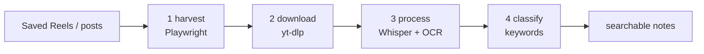
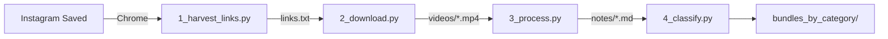
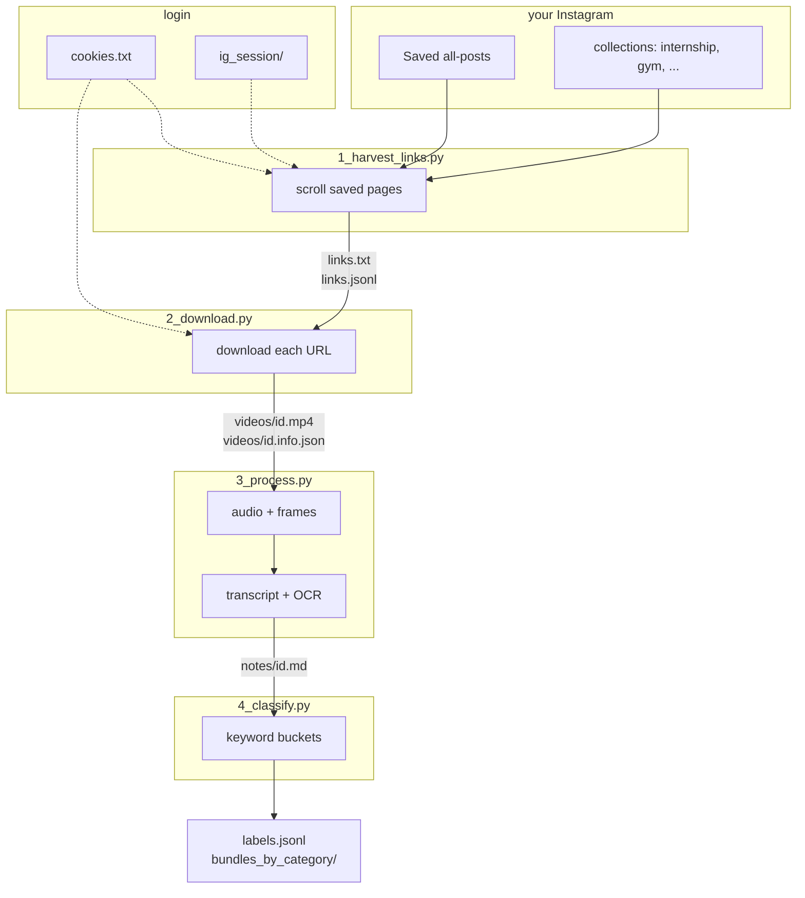
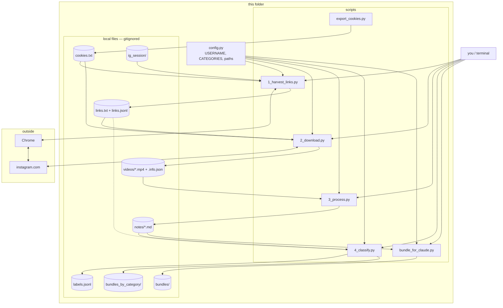
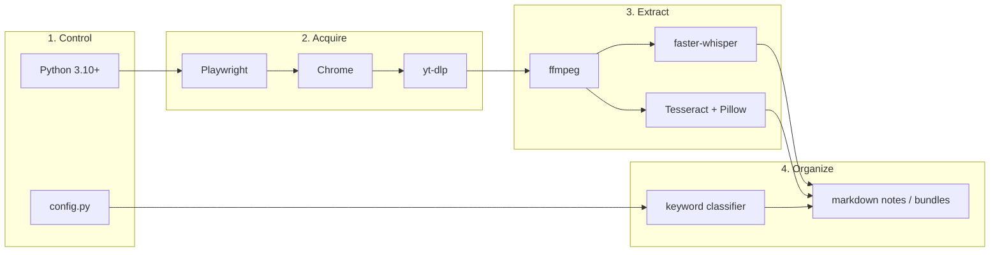
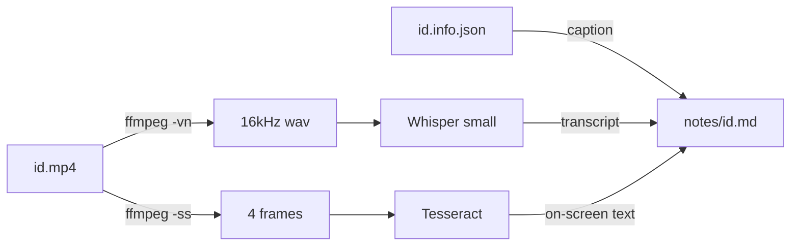
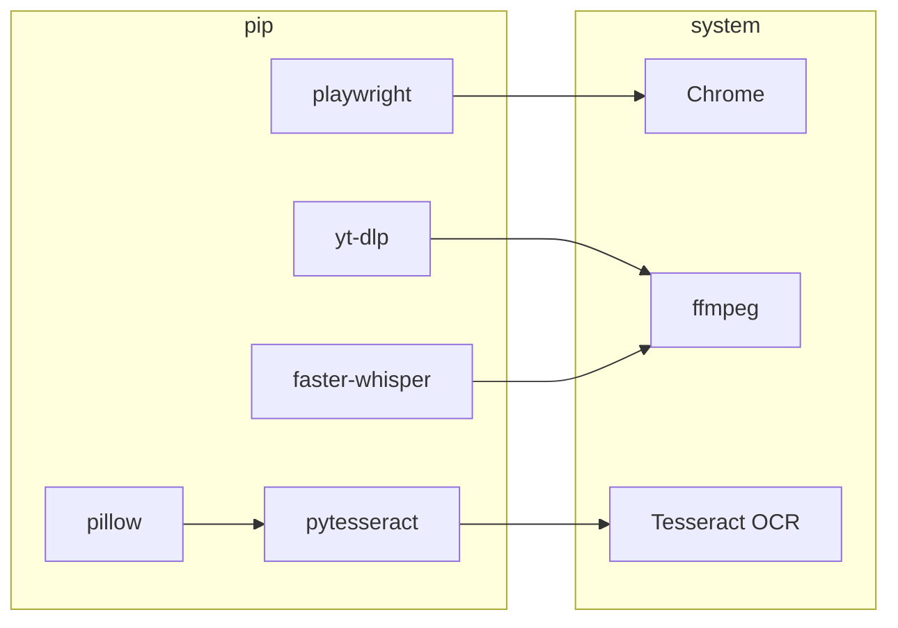

# Instagram Pipelining

Local scripts that pull **your saved Instagram Reels and posts**, then turn them into markdown notes you can search. I use it to find events, internship stuff, and tool links I saved months ago and then forgot about.

Nothing is uploaded. Media and notes stay on disk.

## Pipelining diagram





## Pipeline


Four numbered scripts, in order. Each writes files the next one reads. Stages 2 and 3 skip work that's already done.



```powershell
python 1_harvest_links.py
python 2_download.py
python 3_process.py
python 4_classify.py
```

Optional: `python bundle_for_claude.py` — 25 notes per file, no categories.

## Architecture

Offline, single-machine. You run Python scripts; they talk to Instagram only during harvest/download, then everything else is local files.



**Layers**



No API server, no database. `config.py` is the only “settings” file. GPU is optional (Whisper tries CUDA, then CPU).

**Stage 3 (one video):**




## Tools

| What | Tool | Where |
|------|------|--------|
| Open Instagram, scroll Saved | Playwright + installed Chrome | `1_harvest_links.py` |
| Stay logged in | `cookies.txt` or `ig_session/` | harvest + download |
| Fetch Reels / photos | yt-dlp | `2_download.py` |
| Pull audio and stills | ffmpeg, ffprobe | `3_process.py` |
| Speech → text | faster-whisper (`small`, CUDA then CPU) | `3_process.py` |
| On-screen text | Tesseract + Pillow | `3_process.py` |
| Buckets (events, internships, …) | keywords in `config.py` | `4_classify.py` |



## Setup


Python 3.10+, plus ffmpeg and Tesseract on PATH.

```powershell
pip install -r requirements.txt
playwright install chromium
winget install Gyan.FFmpeg
winget install UB-Mannheim.TesseractOCR
```

```powershell
$env:IG_USERNAME = "your_username"
# if tesseract isn't on PATH:
$env:TESSERACT_CMD = "C:\Program Files\Tesseract-OCR\tesseract.exe"
```

Saved / private posts need a logged-in session. Easiest path: export `cookies.txt` from Chrome (Get cookies.txt LOCALLY) while you're logged into Instagram, drop it in this folder. After a Playwright login you can also run `python export_cookies.py`.

## Run

```powershell
python 1_harvest_links.py    # Chrome window; log in if asked
python 2_download.py         # skips files already in videos/
python 3_process.py          # skips notes that already exist
python 4_classify.py         # labels.jsonl + bundles_by_category/
```

`2` and `3` are safe to re-run. Harvest scrolls `/saved/all-posts/` then whatever collections it finds on `/saved/`.

Optional: `python bundle_for_claude.py` dumps notes into 25-item files under `bundles/` if you don't care about categories.

## Files that show up locally

These are gitignored (cookies, URLs, videos, notes):

```
cookies.txt          ig_session/
links.txt            links.jsonl
videos/              notes/
labels.jsonl         bundles/   bundles_by_category/
```

Edit `CATEGORIES` in `config.py` and re-run stage 4 when the buckets are wrong. Keyword matching is crude — internship-related words in particular over-match.

Use this on your own saved content. Instagram will sometimes bounce harvest (login loop) or yt-dlp (deleted post, dead cookies).
